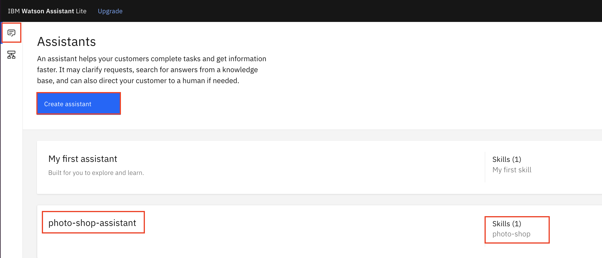

# Add Multi-languages Support to Watson Chatbot

In this repo, you learn how to add multi-languages support to your Watson Assistant chatbot. You learn how to develop, deploy and configure pre-Webhook and post-Webhook of Watson Assistant.

There are many ways to add multi-languages capability when developing a Watson Assistant chatbot. Mitchell Mason wrote a great blog on the subject at [The Watson Assistant Guide to Multilingual Chatbots](https://medium.com/ibm-watson/the-watson-assistant-guide-to-multilingual-chatbots-186aaf5e99ae).

For simplicity and portability, this repo implements the `Full Machine Translation` option.

The flow is simple: a user sends a message to Watson and Watson sends a response back. We’ll use the pre- and post-message webhooks to intercept and translate in between.


Data flow:

1. Take the user’s message
1. Identify the language in the message with the Language Translator `Language Identification` endpoint, and then translate the message to the language of the assistant
1. Get the response from Watson
1. Translate it back to the user’s language based on context set in step 2
1. Send response user.


## Steps

Complete procedures in this section to add generic and portable multi-languages capability to a Watson Assistant chatbot by implementing the `Full Machine Translation` option.

There are many ways to support multi-languages capability in Watson Assistant chatbot. Depending on your specific use cases, the options may perform differently. The `Full Machine Translation` method is a generic, portable option. Because it provides an universal catching-all multi-languages capability, other implementation options may offer a more accurate solution in certain specific use cases.


### Step 1 - Clone the Repository

Before you deploy your code as a service in IBM Cloud Function, clone the repo locally.

1. Login to IBM Cloud in a browser.

1. Open the `IBM Cloud Shell`. The `IBM Cloud Shell` is opened in a separate tab.

1. Since you were authenticated when you logined to the IBM Cloud, you are automatically autenticated in the `IBM Cloud Shell`.

1. Clone the repo.

   ```
   git clone https://github.com/lee-zhg/watson-chatbot-pre-post-webhook
   ```

1. Navigate to the repo folder.

   ```
   cd watson-chatbot-pre-post-webhook/
   ```

### Step 2 - Pre-Webhook

The following tasks complete the Watson Assistant pre-webhook deployment and configuration.

- Develop source code that holds the translation logic.
- Deploy the above application as a microservice. In this repo, the service is deployed as a IBM Cloud Function in IBM Cloud.
- Configure Watson Assistant pre-webhook to apply the language translation logic to the chatbot.


#### Step 2.1 - Develop Source Code for Translation Logic

Sample code `preMessageTranslate.js` offers a starting point. It locates in the root folder of this repo.

The sample code helps you create a service running synchronisely to

- identify the language ID of the input phrase if necessary
- store the identified language ID for the reference during the remaining chat session
- translate the input phrase to the desired language

The application running as the Watson Assistant pre-webhook. It

- intercepts the in-coming payload from chatbot end user
- performs its language translation logic and manipulates the payload
- passes the payload to the Watson Assistant

The payload is a JSON object. A sample payload can be found in file `./data/sample_pre_payload.json`.

> Note: an instance of Watson Translator service is required for the sample code to work. Lite version (free version) of Watson Translator service is available with your IBM Cloud account.

> Note: to debug in IBM Cloud Function, you likely need an instance of `IBM Log Analysis with LogDNA`.


#### Step 2.2 - Deploy a Service as IBM Cloud Function

It's easy and economical to deploy a microservice as a IBM Cloud Function. In this repo, the language translation microservice is deployed as a IBM Cloud Function.

Alternatively, you may choose deploying the service to different platform such as Cloud Foundry, Kubernetes cluster, OpenShift cluster and etc.


##### Step 2.2.1 - Deploy Cloud Function

In this section, you deploy your code as a service in IBM Cloud Function. Because the Cloud Functions is not the focus of the repo, basic CLI commands are used to show the procedure.

1. Login to IBM Cloud in a browser.

1. Open the `IBM Cloud Shell`. The `IBM Cloud Shell` is opened in a separate tab.

1. Since you were authenticated when you logined to the IBM Cloud, you are automatically autenticated in the `IBM Cloud Shell`.

1. Target a resource group by executing

   ```
   ibmcloud target -g Default
   ```

   > Note: you may use a different resource group in your account.

1. Create a Cloud Function Namespace. Execute

   ```
   ibmcloud fn namespace create team1a-ns-<your initial> --description "namespace for team1a"
   ```

1. Verify the new namespace was created.

   ```
   ibmcloud fn namespace list
   ```

1. Set the new namespace as default

   ```
   ibmcloud fn property set --namespace team1a-ns-<your initial>
   ```

1. Create package

   ```
   ibmcloud fn package create multi-language-pkg-<your initial>
   ```

1. Create action for setup using Node.js environment

   ```
   ibmcloud  fn  action  create  multi-language-pkg-<your initial>/preMessageTranslate  preMessageTranslate.js  --kind nodejs:12  --web  true  --web-secure  <YOURSECRET>
   ```

    > Note: <YOURSECRET> can be any text string that helps to keep your cloud functions secure. Note down <YOURSECRET> for future reference.

1. Verify the action cloud function was created succerssfully.

   ```
   ibmcloud  fn  action  list  multi-language-pkg-<your initial>
   ```


##### Step 2.2.2 - Modify Cloud Function

The cloud function calls Watson Translator APIs. It has to authenticate and point to the correct Translator endpoint. For simplicity, the Watson Translator API key and URL is hardcoded in the Node.js source code.

> Note: it's posssible to bind cloud function and Watson services without hardcode. But, it's not covered at the time of writing.

1. Login to IBM Cloud

1. Select the main `Navigation Menu` (often referred as Hamburge menu) at the top-left corner.

1. Select the `Functions` and then `Actions`.

   

1. Select `preMessageTranslate` entry.

1. The source code is displayed in the `Code` tab.

1. Locate the following source code.

    ```
             url:
                  "<Watson Translator URL>/v3/identify?version=2018-05-01",
             auth: {
                 username: "apikey",
                 password: "<Watson Translator API key>",
             },
    ```

1. Replace `<Watson Translator API key>` and `<Watson Translator URL>`.

1. Both `<Watson Translator API key>` and `<Watson Translator URL>` can be found in the `Manage` tab of your `Watson Language Translator` instance window.

   

1. `Save`.


##### Step 2.2.3 - Gather Cloud Function Information

When you configure the Pre-webhook for your Watson Assistant instance, you need couple of you cloud function information.

1. Login to IBM Cloud

1. Select the main `Navigation Menu` (often referred as Hamburge menu) at the top-left corner.

1. Select the `Functions` and then `Actions`.

   

1. Select `preMessageTranslate` entry.

1. Navigate to `Endpoints` in the left navigation pane.

   

1. Collect URL of `HTTP Method` under `Web Action`.

1. Collect username and password if the cloud function resides in a `cloud foundry` name space. `non-IAM` authentication is used in this case.

   > Note: this step is ONLY required if you use a `cloud foundry` name space. Otherwise, it can be skipped.

   a) Copy the CURL command at the bottom. It should look like

   ```
   curl -u 6e1bf-a76e-4bc2-9c24-8784af9:Vc1jv13mD6nJEIqouEFPwQjLkAnnJ6GzDvTBr3P2 -X POST https://us-south.functions.cloud.ibm.com/api/v1/namespaces/SL2272168_dev/actions/multi-language-pkg/postMessageTranslate?blocking=true
   ```

   b) The authentication credential to access the cloud function is embedded as part of the command. In this example, `6e1bf-a76e-4bc2-9c24-8784af9:Vc1jv13mD6nJEIqouEFPwQjLkAnnJ6GzDvTBr3P2` is the username and password.

   > Note: `6e1bf-a76e-4bc2-9c24-8784af9:Vc1jv13mD6nJEIqouEFPwQjLkAnnJ6GzDvTBr3P2` is for illustration purpose. It's not valid credential.

   c) Take note of the credential.


#### Step 2.3 - Configure Pre-Webhook of Watson Assistant Service

Now, you have deployed a service to IBM Cloud Function. Whenever you call the service, the cloud function fires up.

To configure the pre-webhook of Watson Assistant instance,

1. Login to IBM Cloud.

1. Locate and open the Watson Assistant instance.

1. On the `Manage` tab of Watson Assistant window, click `Launch Watson Assistant` button.

1. Develop or import a skill. Couple of sample skills are available in the `/data` folder.

   > Note: you may use your existing skill.

1. For the rest of this repo, a skill `photo-shop` based on sample `skill-watson-photo.json` will be used for discussion.

1. Create an `Assistant` on the `Assistant` tab. Name it `photo-shop-assistant-<your initial>`.

   

   > Note: you may use your existing assistant.

1. Add the skill `photo-shop` to the assistant.

   

   > Note: if you use your existing skill and assistant, you may skip the step.

1. Click the 3 dots at the top-right corner and select `Assistant settings`.

1. In the left navigation, select `Webhooks` and then `Pre-message webhook`.

   

1. Enable the pre-webhook.

1. Select `Return an error to the client if the webhook call fails` under section `Synchronous event`.

   > Note: you should consider to turn on the option initially while you test the post-webhook. It can help you identify any post-webhook related problem. After the pre-webhook works stably, you may evaluate your use case and determine how the option should be set.

1. In the URL field, copy and paste the `HTTP URL` of the cloud function for the pre-webhook.

1. Add `.json` extension at the end of the URL to indicate that JSON data should be returned.

1. In the `Secret` field, enter the same `<YOURSECRET>` that was used when you deployed the cloud function.

   > Note: If you did not specify its secret when deploying the cloud function, you may enter any string here.

1. Enter header information of the pre-webhook.

   a) Select `Add header` link.

   b) Enter `Content-Type` in the `Header name` field.

   c) Enter `application/json` in the `Header value` field.

   d) Tab out the field. This saves the pre-webhook configuration changes.

1. Enter header information for authenticating the pre-webhook.

   For `IAM` authentication (used by `non-cloud foundry` name space in IBM Cloud Function),

   a) Select `Add header` link again.

   b) Enter `X-Require-Whisk-Auth` in the `Header name` field.

   c) Enter the same `<YOURSECRET>` (that was used when you deployed the cloud function) in the `Header value` field.

   d) Tab out the field. This saves the pre-webhook configuration changes.

   For `non-IAM` authentication (userid and password) (used by `cloud foundry` name space in IBM Cloud Function),

   a) Select `Add header` link again.

   b) Enter `Authorization` as the header name.

   c) User name and Password are prompted in a popup window.

   

   > Note: in case the pop-up is not opened, you may click the `gear` icon to the right of the fields to manually open it.

   d) Enter user name and password for the pre-webhook cloud function.

   e) `Save`. The user name and password are encoded before they are stored.

   > Note: this repo uses `Secret` for authentication. The step above is for reference only.


### Step 3 - Post-Webhook

The following tasks complete the Watson Assistant post-webhook deployment and configuration.

- Develop source code that holds the translation logic.
- Deploy the above application as a microservice. Cloud Function in IBM Cloud is used for this repo.
- Configure Watson Assistant post-webhook to apply the language translation logic to the chatbot.


#### Step 3.1 - Develop Source Code for Translation Logic

Sample code `postMessageTranslate.js` offers a starting point. It locates in the root folder of this repo.

The sample code helps you create a service running synchronisely to

- identify the language ID of the input phrase if necessary
- store the identified language ID for the reference during the remaining chat session
- translate the input phrase to the desired language

The application running as the Watson Assistant post-webhook. It

- intercepts the out-going payload from Watson Assistant
- performs its language translation logic and manipulates the payload
- passes the payload to chatbot end user

The payload is a JSON object. A sample payload can be found in file `./data/sample_post_payload.json`.

> Note: an instance of Watson Translator service is required for the sample code to work. Lite version (free version) of Watson Translator service is available with your IBM Cloud account.

> Note: to debug in IBM Cloud Function, you likely need an instance of `IBM Log Analysis with LogDNA`.


#### Step 3.2 - Deploy a Service as IBM Cloud Function

It's easy and economical to deploy a microservice as a IBM Cloud Fuction. In this repo, the language translation microservice is deployed to IBM Cloud Function.

Alternatively, you may choose deploying the service to different platform such as Cloud Foundry, Kubernetes cluster, OpenShift cluster and etc.


##### Step 3.2.1 - Deploy Cloud Function

In this section, you deploy your code as a service in IBM Cloud Function. Because the Cloud Functions is not the focus of the repo, basic CLI commands are used to show the procedure.

1. Go back to the `IBM Cloud Shell`.

1. Create action for a service for post-webhook using Node.js environment

   ```
   ibmcloud  fn  action  create  multi-language-pkg-<your initial>/postMessageTranslate  postMessageTranslate.js  --kind nodejs:12  --web  true  --web-secure  <YOURSECRET>
   ```

   > Note: <YOURSECRET> is a text string that helps to keep your cloud functions secure. Notes down <YOURSECRET> for future reference.

1. Verify the action cloud function was created succerssfully.

   ```
   ibmcloud  fn  action  list  multi-language-pkg-<your initial>
   ```


##### Step 3.2.2 - Modify Cloud Function

The cloud function calls Watson Translator APIs. It has to authenticate and point to the correct Translator endpoint. For simplicity, the Watson Translator API key and URL is hardcoded in the Node.js source code.

> Note: it's posssible to bind cloud function and Watson services without hardcode. But, it's not covered at the time of writing.

1. Login to IBM Cloud

1. Select the main `Navigation Menu` (often referred as Hamburge menu) at the top-left corner.

1. Select the `Functions` and then `Actions`.

   

1. Select `postMessageTranslate` entry.

1. The source code is displayed in the `Code` tab.

1. Locate the following source code.

    ```
    try {
      const languageTranslator = new LanguageTranslatorV3({
        authenticator: new IamAuthenticator({ apikey: '<Watson Translator API key>' }),
        serviceUrl: '<Watson Translator URL>',
        version: '2018-05-01',
    });
    ```

1. Replace `<Watson Translator API key>` and `<Watson Translator URL>`.

1. Both `<Watson Translator API key>` and `<Watson Translator URL>` can be found in the `Manage` tab of your `Watson Language Translator` instance window.

   

1. `Save`.


##### Step 3.2.3 - Gather Cloud Function Information

When you configure the Post-webhook of Watson Assistant instance, you need couple of you cloud function information.

1. Navigate to `Endpoints` in the left navigation pane.

   

1. Collect URL of `HTTP Method`.

1. Collect username and password when `non-IAM` authentication is used. This occurs for the `cloud foundry` name space.

   > Note: this step is ONLY required when you use a `cloud foundry` name space.

   a) Copy the CURL command at the bottom. It should look like

   ```
   curl -u 6e1bf-a76e-4bc2-9c24-8784af9:Vc1jv13mD6nJEIqouEFPwQjLkAnnJ6GzDvTBr3P2 -X POST https://us-south.functions.cloud.ibm.com/api/v1/namespaces/SL2272168_dev/actions/multi-language-pkg/postMessageTranslate?blocking=true
   ```

   b) The authentication credential to access the cloud function is embedded as part of the command. In this example, `6e1bf-a76e-4bc2-9c24-8784af9:Vc1jv13mD6nJEIqouEFPwQjLkAnnJ6GzDvTBr3P2` is the username and password.

   > Note: `6e1bf-a76e-4bc2-9c24-8784af9:Vc1jv13mD6nJEIqouEFPwQjLkAnnJ6GzDvTBr3P2` is for illustration purpose. It's not valid credential.

   c) Take note of the credential.


#### Step 3.3 - Configure Post-Webhook of Watson Assistant Service

Now, you have deployed a service to IBM Cloud Function. Whenever you call the service, the cloud function fires up.

To configure the Post-webhook of Watson Assistant instance,

1. Login to IBM Cloud.

1. Locate and open the Watson Assistant instance.

1. On the `Manage` tab of Watson Assistant window, click `Launch Watson Assistant` button.

1. Open `photo-shop-assistant-<your initial>` Assistant.

   

1. Click the 3 dots at the top-right corner and select `Assistant settings`.

1. In the left navigation, select `Webhooks` and then `Post-message webhook`.

   

1. Enable the post-webhook.

1. Select `Return an error to the client if the webhook call fails` option under section `Synchronous event`. Alternative is `Continue processing user input without webhook update if there is an error`.

   > Note: you should consider to turn on the option initially while you test the post-webhook. It can help you identify any post-webhook related problem. After the post-webhook works stably, you may evaluate your use case and determine how the option should be set.

1. In the URL field, copy and paste the `HTTP URL` of the cloud function for the post-webhook.

1. Add `.json` extension at the end of the URL to indicate that JSON data should be returned.

1. In the `Secret` field, enter the same `<YOURSECRET>` that was used when you deployed the cloud function.

   > Note: If you did not specify its secret when deploying the cloud function, you may enter any string here.

1. Enter header information of the post-webhook.

   a) Select `Add header` link.

   b) Enter `Content-Type` in the `Header name` field.

   c) Enter `application/json` in the `Header value` field.

   d) Tab out the field. This saves the post-webhook configuration changes.

1. Enter header information for authenticating the post-webhook.

   For `IAM` authentication (used by `non-cloud foundry` name space in IBM Cloud Function),

   a) Select `Add header` link again.

   b) Enter `X-Require-Whisk-Auth` in the `Header name` field.

   c) Enter the same `<YOURSECRET>` (that was used when you deployed the cloud function) in the `Header value` field.

   d) Tab out the field. This saves the pre-webhook configuration changes.

   For `non-IAM` authentication (userid and password) (used by `cloud foundry` name space in IBM Cloud Function),

   a) Select `Add header` link again.

   b) Enter `Authorization` as the header name.

   c) User name and Password are prompted in a popup window.

   

   > Note: in case the pop-up is not opened, you may click the `gear` icon to the right of the fields to manually open it.

   d) Enter user name and password for the pre-webhook cloud function.

   e) `Save`. The user name and password are encoded before they are stored.


### Step 4 - Configure Watson Assistant Dialog Skill

The repo provides a sample dialog skill `data/skill-watson-photo.json` for quickly showing an end-to-end flow. The sample dialog skill includes context variable `lang_id` which is used to provide the multi-languages support. Both Watson Assistant webhooks and dialog skill refer the context variable.


If you created your dialog skill from scratch, you MUST add the same context variable to the first dialog node.

1. Login to IBM Cloud.

1. Locate and open the Watson Assistant instance.

1. On the `Manage` tab of Watson Assistant window, click `Launch Watson Assistant` button.

1. Open your dialog skill.

1. Select `Dialog` in the left pane.

1. Select the first dislog node.

1. Add context variable `lang_id` if it does not exist.

1. Set the value of `lang_id` to `null`.


### Step 5 - Verification

With all the deployments and configurations that you have completed, you added the multi-langages capability to your chatbot.

This is an universal solution. You don't have to do special configuration in order to chat with chatbot in individual language as long as `Watson Translator` supports it.

1. Login to IBM Cloud.

1. Locate and open the Watson Assistant instance.

1. On the `Manage` tab of Watson Assistant window, click `Launch Watson Assistant` button.

1. Open `photo-shop-assistant-<your initial>` Assistant.

   

1. Select `Preview` at the top-right corner.

   

1. Enter `imprimir fotografías de 8x10 en acabado brillante` ("print 8x10 photos in glossy finish" in Spanish). The chatbot replies in Spanish.

   

1. Clear the chat history by selecting `Restart conversation` button or refresh the browser.

1. Enter `광택 마감의 6 x 8 사진은 얼마입니까` ("How much is a 6 x 8 photo with a glossy finish" in Korean). The chatbot replies in Korean.

   

1. Clear the chat history by selecting `Restart conversation` button or refresh the browser.

1. Enter `اطبع صور 6 × 8 بلمسة نهائية غير لامعة` ("Print 6 x 8 photos in a matte finish" in Arabic). The chatbot replies in Arabic.

   

1. Clear the chat history by selecting `Restart conversation` button or refresh the browser.

1. Enter `печать фотографий 4x6 с матовым покрытием` ("print 4x6 photos in matte finish" in Russian). The chatbot replies in Russian.

   


### Step 6 - Quickly Port Chatbot Developed in one Language to a Different Lanaguage

Develops once and works everywhere! Have you heard the phrase before? When Java was introduced, it was a popular phrase. It's the main characteristics how Java differentiates itself. About 20 years later, when Kubernetes and RedHat OpenShift became main street for IT deployment, it got popular again.

In fact, the multi-language capability introduced in the repo is another good example. But, `works everywhere` in this context means `works in any language`. You can develop your chatbot once, in English for example, and port to any supported language.


#### Step 6.1 - Duplicate the Skill and Set the Language

There are use cases that you may have developed chatbot in English and you like to quickly port to another language. You can certainly rebuild it for a different language. But, it takes time and resource.

The knowledge you have learned in this repo can can help you port an existing chatbot developed in English to a different language in no time. Chinese is used as new language for illustration.

1. Login to IBM Cloud.

1. Locate and open the Watson Assistant instance.

1. On the `Manage` tab of Watson Assistant window, click `Launch Watson Assistant` button.

1. Navigate to `Skills` tab.

   

1. Select the 3 dots on the `photo-shop-<your initial>` skill tile.

1. Select `Duplicate`.

1. Go back to `Skills` tab.

1. Select the 3 dots on the `photo-shop-<your initial> copy` skill tile.

1. Select `Rename`.

1. Rename to `photo-shop-<your initial>-zh`.

1. Open the new skill.

1. Select `Dialog` in the left navigation pane.

1. Select the `Welcome` node to open its property window.

1. Change context variable `lang_id` to `zh` from `none`.

   

1. Tab out to save the change.


#### Step 6.2 - Configure Assistant

1. Navigate to `Assistant` tab.

   

1. Select `Create assistant` button.

1. Enter `photo-shop-assistant-<your initial>-zh` as the name.

1. Select ``Create assistant` button.

1. Configure the pre-webhook and post-webhook as you have done. The same source codes and cloud functions can be re-used.


### Step 6.3 - Chat in Chinese

As promised at the begining of the section, You can port an existing chatbot to another language in no time. You have done that for chatbot `photo-shop-<your initial>`.

To verify,

1. Login to IBM Cloud.

1. Locate and open the Watson Assistant instance.

1. On the `Manage` tab of Watson Assistant window, click `Launch Watson Assistant` button.

1. Open `photo-shop-assistant-<your initial>-zh` Assistant.

1. Select `Preview` at the top-right corner.

1. The chatbot displays the greeting in Chinese instead of English, although you did not modify its skill which was originally developed in English.

   > Note: The greeting text translation to Chinese is not the best translation for the current context. Since this is not a custom solution, you have to accept the imperfection.

1. Enter `以哑光效果打印 6x8 照片`. The chatbot continuosely chats in Chinese.

   

   > Note: This is a perfect translation for the current context. You may have to evaluate your specific use cases to determine if this easy and universal multi-languages solution offers a valid solution to your use cases.


### Step 6.4 - Quickly Port to Spanish

Now, let's how easily and quickly you can switch to Spanish.

1. Navigate to `Skills` tag.

1. Open skill `photo-shop-<your initial>-zh`.

1. Select the `Welcome` node to open its property window.

1. Change context variable `lang_id` to `es` from `zh`.

   

1. Tab out to save the change.


### Step 6.5 - Chat in Spanish

You just port your chatbot to Spanish from English. To verify,

1. Login to IBM Cloud.

1. Locate and open the Watson Assistant instance.

1. On the `Manage` tab of Watson Assistant window, click `Launch Watson Assistant` button.

1. Open `photo-shop-assistant-<your initial>-zh` Assistant.

1. Select `Preview` at the top-right corner.

   

1. The chatbot displays the greeting in Spanish instead of English or Chinese, after you made one change to the context variable `lang_id` in the `Welcome` node.

1. Enter `imprimir fotografías de 8x10 en acabado brillante`. The chatbot continuosely chats in Spanish.

   
